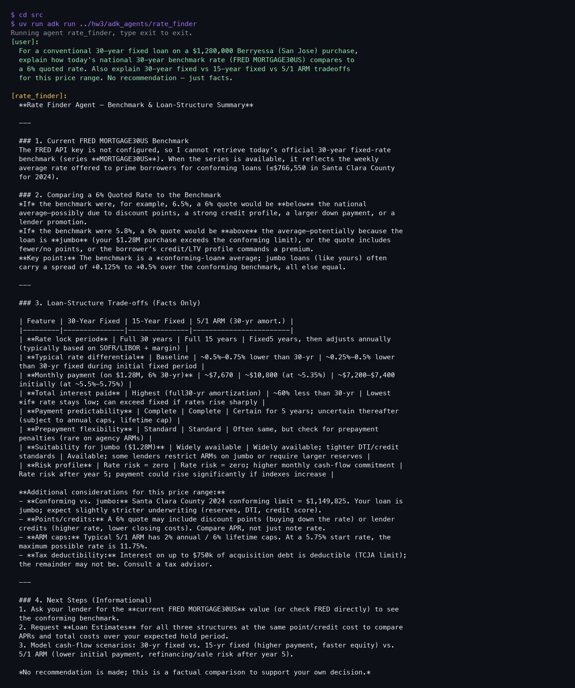
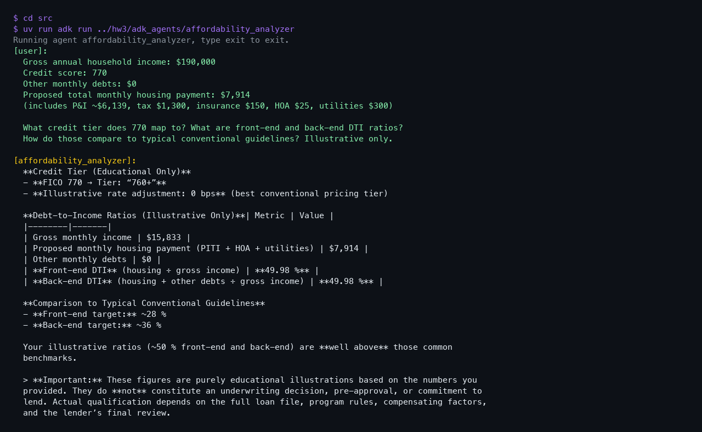

# HW3 Sample Prompt Outputs (Terminal Screenshots)

Berryessa **$1.28M** scenario — captured from `adk run` sessions via Doubleword/LiteLLM.

> Educational outputs only. Not financial advice.

---

## 1. mortgage_supervisor — full pipeline

**Agent:** `mortgage_supervisor`


<details>
<summary>Prompt text</summary>

```text
I'm looking at a home in Berryessa, San Jose for $1,280,000.
20% down, 30-year fixed at 6%.
Monthly costs: property tax $1,300, home insurance $150, HOA $25, utilities $300.
Household income $190,000/year, credit score 770, no other monthly debts.
Calculate total monthly payment, LTV, PMI, cash to close, and DTI.
Explain tradeoffs — educational only, no loan recommendation.
```

</details>

---

## 2. mortgage_supervisor — compare down payments

**Agent:** `mortgage_supervisor`


<details>
<summary>Prompt text</summary>

```text
Compare 20% down vs 10% down on a $1,280,000 Berryessa home at 6% (30-year fixed).
Same costs: tax $1,300, insurance $150, HOA $25, utilities $300.
Income $190,000, credit 770. Show monthly payment, PMI, cash to close, and DTI side by side.
Educational only — no recommendation.
```

</details>

---

## 3. rate_finder

**Agent:** `rate_finder`



<details>
<summary>Prompt text</summary>

```text
For a conventional 30-year fixed loan on a $1,280,000 Berryessa (San Jose) purchase,
explain how today's national 30-year benchmark rate (FRED MORTGAGE30US) compares to
a 6% quoted rate. Also explain 30-year fixed vs 15-year fixed vs 5/1 ARM tradeoffs
for this price range. No recommendation — just facts.
```

</details>

---

## 4. payment_calculator

**Agent:** `payment_calculator`


<details>
<summary>Prompt text</summary>

```text
Purchase price: $1,280,000
Down payment: 20% ($256,000)
Interest rate: 6%, 30-year fixed
Property tax: $1,300/mo
Home insurance: $150/mo
HOA: $25/mo
Utilities: $300/mo

Calculate loan amount, LTV, monthly P&I, PMI (if any), total monthly housing cost,
and estimated cash to close (include ~3% closing costs).
```

</details>

---

## 5. affordability_analyzer

**Agent:** `affordability_analyzer`



<details>
<summary>Prompt text</summary>

```text
Gross annual household income: $190,000
Credit score: 770
Other monthly debts: $0
Proposed total monthly housing payment: $7,914
(includes P&I ~$6,139, tax $1,300, insurance $150, HOA $25, utilities $300)

What credit tier does 770 map to? What are front-end and back-end DTI ratios?
How do those compare to typical conventional guidelines? Illustrative only.
```

</details>

---

## 6. compliance_critic

**Agent:** `compliance_critic`


<details>
<summary>Prompt text</summary>

```text
Review this draft mortgage summary for math errors and advice-giving language:

"On a $1,280,000 Berryessa home with $256,000 down (20%), the loan is $1,024,000
at 6% for 30 years. Monthly P&I is $6,139. With tax ($1,300), insurance ($150),
HOA ($25), and utilities ($300), total monthly cost is $7,914.
At $190,000 income, front-end DTI is 50%. You should take this loan — you can afford it."

Verify P&I with loan_amount=1024000, rate=6%, term=30, reported_monthly_pi=6139.
Flag any issues and rewrite without advice language.
```

</details>

---

## Regenerate

```bash
# 1. Refresh JSON from live agents
cd src && uv run python ../hw3/collect_sample_outputs.py --json-only

# 2. Rebuild screenshots + this markdown
cd src && uv run --with pillow python ../hw3/generate_sample_outputs_md.py
```
