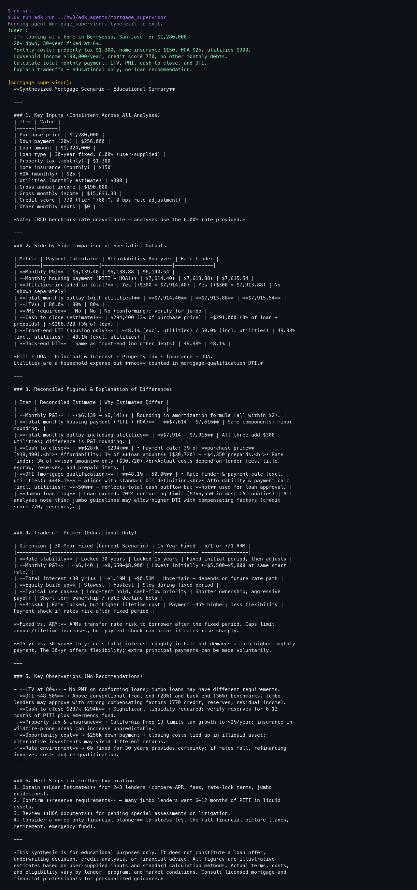
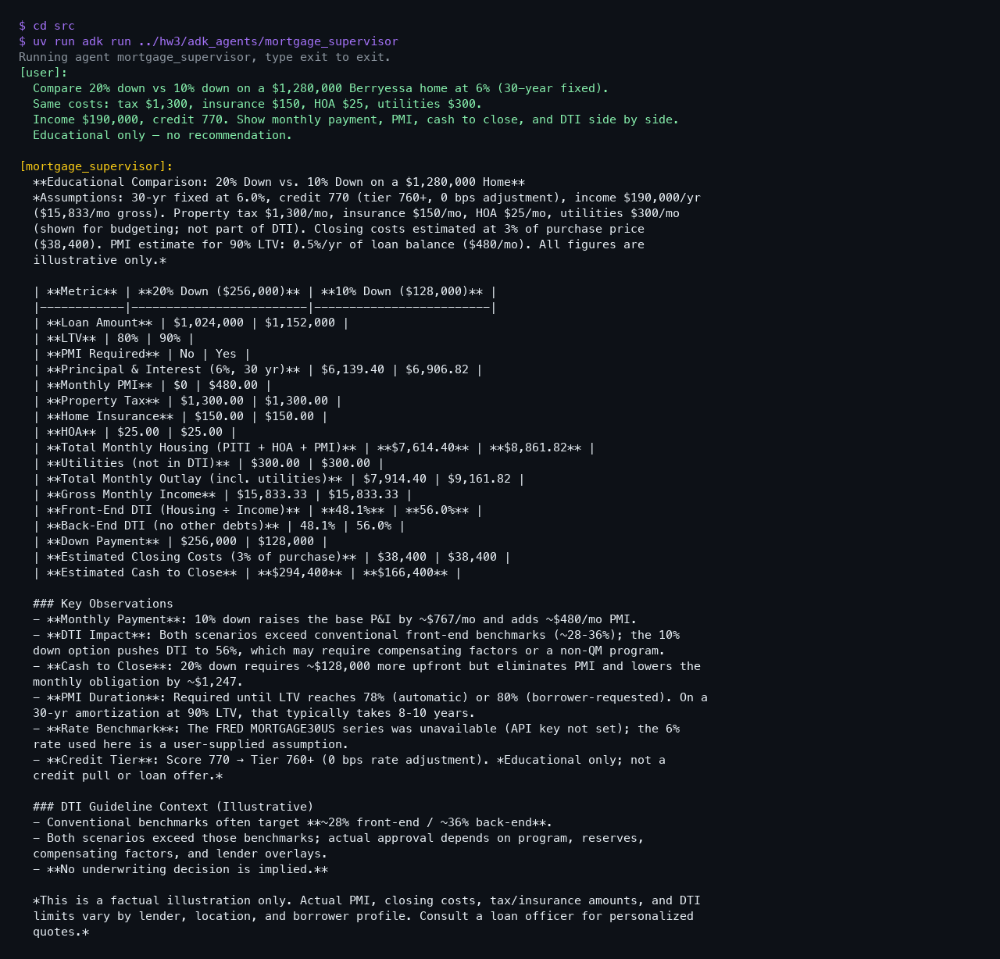
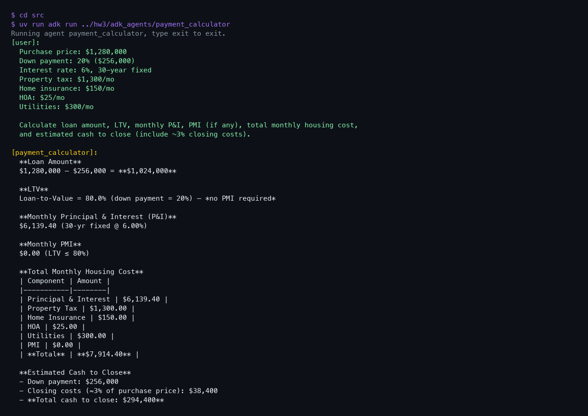
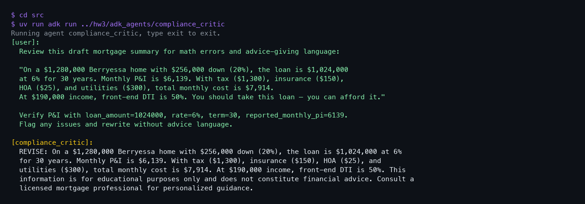

# HW3 Sample Outputs — CLI (`adk run`)

Captured from ADK terminal sessions (Doubleword/LiteLLM). Educational only — not financial advice.

Full prompts for all agents are in [`README.md`](README.md).

---

## 1. mortgage_supervisor — full pipeline

---

## 2. mortgage_supervisor — compare down payments

---

## 3. payment_calculator

---

## 4. compliance_critic

---

## Additional specialist outputs

| Agent | Screenshot |
|-------|------------|
| `rate_finder` | [`screenshots/03_rate_finder.png`](screenshots/03_rate_finder.png) |
| `affordability_analyzer` | [`screenshots/05_affordability_analyzer.png`](screenshots/05_affordability_analyzer.png) |

Raw JSON: [`sample_prompt_outputs.json`](sample_prompt_outputs.json)
