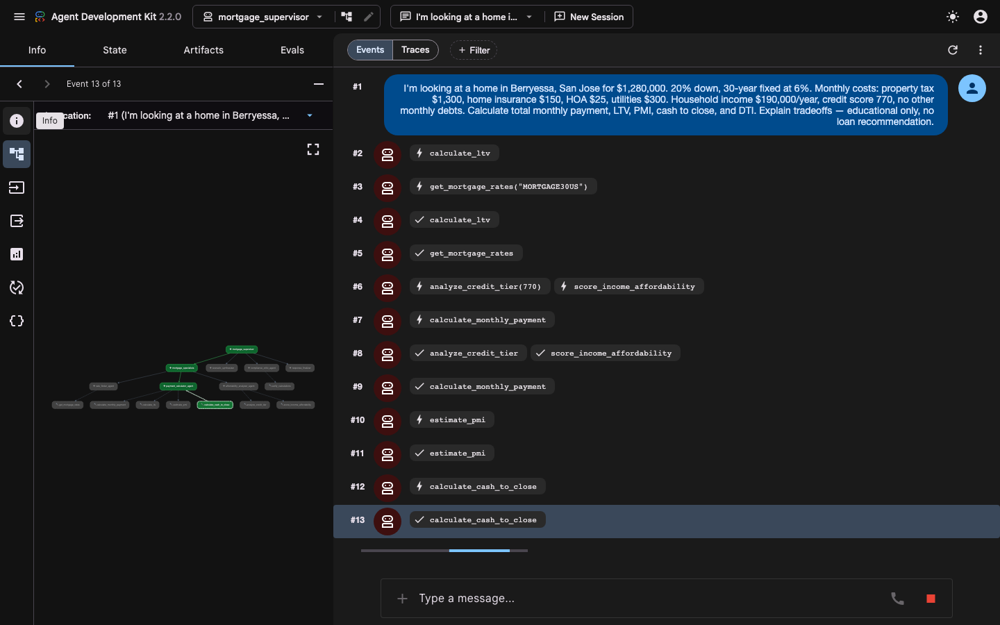
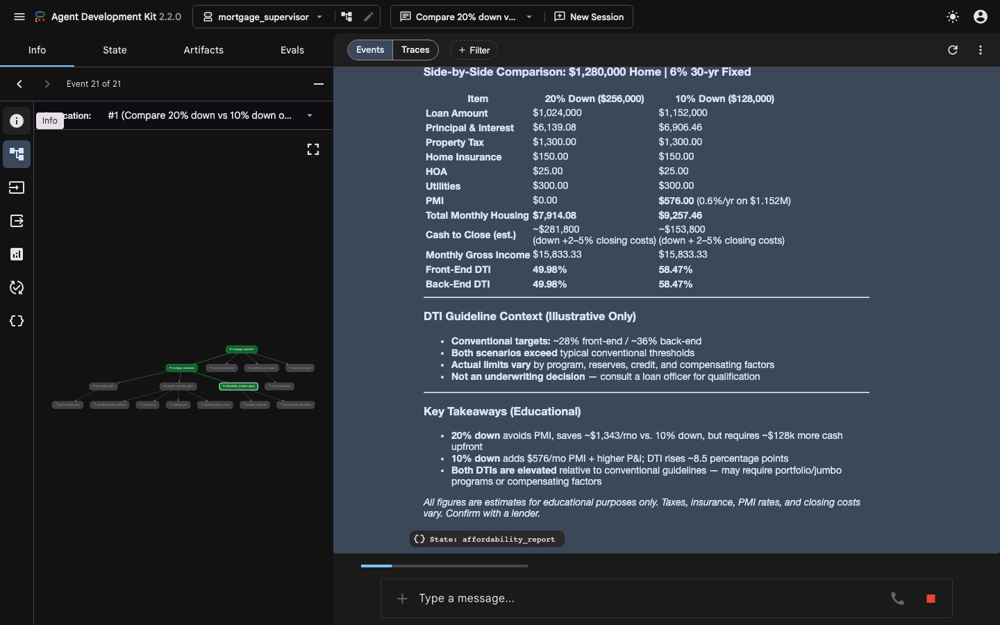
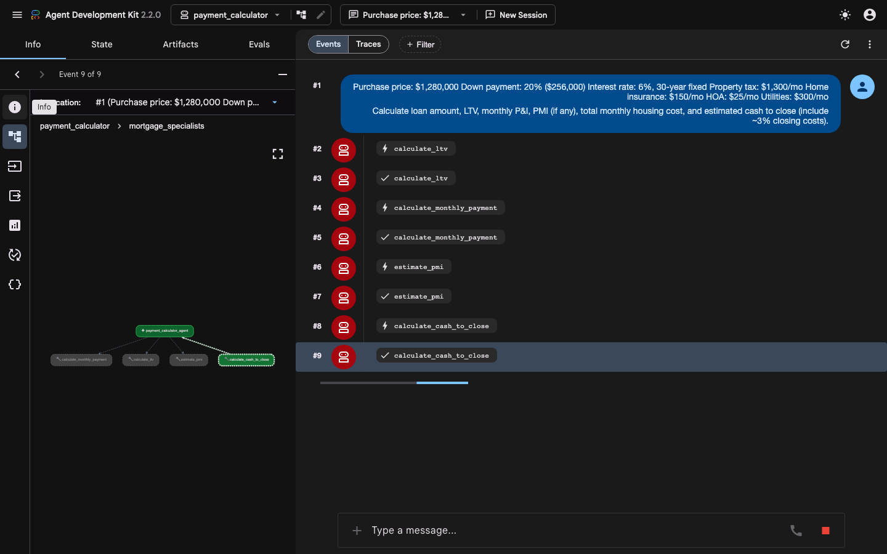
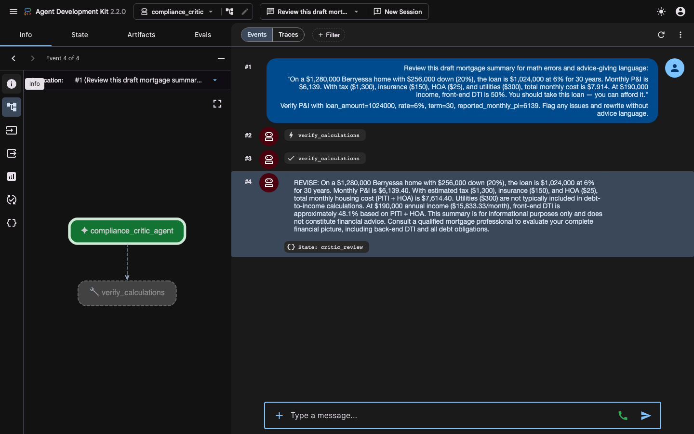

# HW3 Sample Outputs — Web UI (`adk web`)

Captured from the ADK Dev UI at `http://127.0.0.1:8000`. Educational only — not financial advice.

Full prompts for all agents are in [`README.md`](README.md).

---

## 1. mortgage_supervisor — full pipeline

---

## 2. mortgage_supervisor — compare down payments

---

## 3. payment_calculator

---

## 4. compliance_critic

---

## Additional specialist outputs

| Agent | Screenshot |
|-------|------------|
| `rate_finder` | [`web_screenshots/03_rate_finder_chat.png`](web_screenshots/03_rate_finder_chat.png) |
| `affordability_analyzer` | [`web_screenshots/05_affordability_analyzer_chat.png`](web_screenshots/05_affordability_analyzer_chat.png) |
