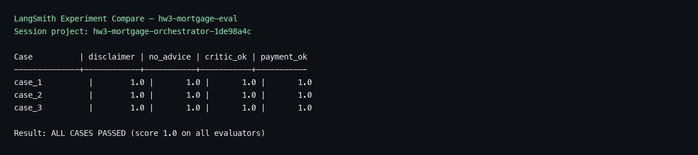
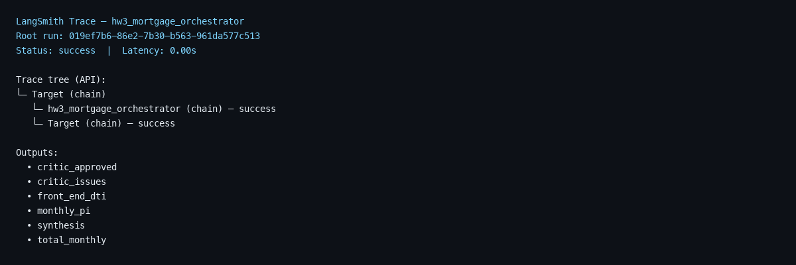

# HW3 Learnings — Jason Lim

**UCSC AI Agent Applications** · June 2026

Repository: https://github.com/jhhlim/ucsc-ai-agent-course/tree/main/hw3

---

## What I built

Multi-agent mortgage scenario analyzer following the course proposal pattern:

**Supervisor → Parallel specialists → Synthesizer → Compliance Critic → Finalizer**

| Agent | Role |
|-------|------|
| Rate Finder | FRED benchmark rates, loan structure |
| Payment Calculator | P&I, LTV, PMI, cash to close |
| Affordability Analyzer | Credit tier, DTI |
| Compliance Critic | `verify_calculations`, advice-language filter |

Two implementations share the same tools: ADK agents (`adk_agents/`) and a Python orchestrator (`orchestrator.py`) with a critic loop.

**Example scenario** (Berryessa, $1.28M, 6%, 20% down, $190k income, 770 credit): ~$6,139/mo P&I, ~$7,914/mo total, 80% LTV, ~50% front-end DTI.

---

## Observations

- Multi-agent output was more structured than a single-agent approach, but coordination cost was higher than building the calculation tools.
- Passing context between specialists and the synthesizer required careful prompt design — orchestration mattered more than prompt wording alone.
- Mortgage math (`run_scenario.py`, tool functions) was deterministic; LLM phrasing and number parsing varied by run.
- The compliance critic caught *"You should take this loan — you can afford it"* in a test draft and flagged it even when specialist agents did not.
- ADK Web UI helped inspect tool calls per agent; the deterministic CLI was faster for verifying formulas.
- Full supervisor runs took 30–60+ seconds (five LLM stages after parallel specialists).

---

## Challenges

- Defining non-overlapping agent responsibilities without duplicating work.
- ADK web initially froze — fixed by correcting import paths and using `hw3/adk_agents/` layout.
- `verify_calculations` initially failed when passed as a JSON string; structured parameters resolved it.
- Ensuring the critic received enough context (loan amount, reported P&I) to validate math and language.

---

## LangSmith evaluation

| Scorer | Checks |
|--------|--------|
| `has_disclaimer` | Educational / not-advice disclaimer present |
| `no_advice_language` | No "you should", "you can afford", etc. |
| `critic_approved` | Python critic loop approved synthesis |
| `payment_accuracy` | P&I within $1 of `verify_calculations` |

```bash
cd src && uv run --with langsmith python ../hw3/langsmith_eval.py
```

**Results:** 3 eval cases, all scorers passed (score 1.0). Berryessa P&I: expected 6139.4, reported 6139.4.

- [Experiment project](https://smith.langchain.com/o/0e0ab241-41c6-425d-afbb-dbeafa0df253/projects/p/hw3-mortgage-orchestrator-1de98a4c)
- [Dataset compare view](https://smith.langchain.com/o/0e0ab241-41c6-425d-afbb-dbeafa0df253/datasets/6d59adcf-52d4-40e9-b702-ae5528fe0e77/compare?selectedSessions=f4ca9e9d-e606-4a37-a059-a71297d132db)





Screenshots rendered from the LangSmith API (`render_langsmith_eval_png.py`). Full interactive traces require signing in at the compare URL above.

---

## What I would do differently

- Add ADK `LoopAgent` for multi-pass critic revision in the LLM pipeline (currently one critic pass + finalizer).
- Extend LangSmith eval with more scenarios and an LLM-as-judge scorer.
- Compare Gemini 2.5 against Doubleword on reasoning quality.
- Add property tax / insurance lookups via external APIs instead of user-supplied values.

---

## Takeaway

Agent coordination, validation, and evaluation were harder than the individual mortgage tools. The compliance critic acted as a useful verification layer before showing results to the user. LangSmith provided repeatable scoring on top of manual testing.
