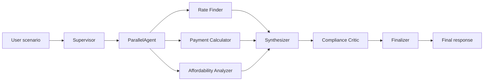

# HW3 — Multi-Agent Mortgage Explainer & Scenario Calculator

**UCSC AI Agent Applications** · Jason Lim

Educational mortgage scenario analysis using Google ADK. The system accepts arbitrary purchase inputs (price, down payment, rate, income, credit, monthly costs) and returns a structured payment breakdown with affordability metrics. Outputs are illustrative only — not financial advice.

## Example scenario

Berryessa (San Jose): **$1.28M** purchase, **6%** 30-year fixed, **20% down**, **$190k** income, **770** credit. Monthly costs: tax $1,300, insurance $150, HOA $25, utilities $300.

| Metric | Value |
|--------|-------|
| P&I | ~$6,139/mo |
| Total monthly | ~$7,914/mo |
| LTV | 80% (no PMI) |
| Front-end DTI | ~50% |
| Cash to close | ~$294,400 |

---

## Architecture



| Agent | Role | Tools |
|-------|------|-------|
| Rate Finder | Benchmark rates, loan structure | `get_mortgage_rates` (FRED) |
| Payment Calculator | P&I, LTV, PMI, cash to close | `calculate_*`, `estimate_pmi` |
| Affordability Analyzer | Credit tier, front/back-end DTI | `analyze_credit_tier`, `score_income_affordability` |
| Synthesizer | Combines specialist outputs | — |
| Compliance Critic | Math verification, advice filter | `verify_calculations` |
| Finalizer | Applies critic feedback | — |

Implemented in two layers: **ADK agents** (`adk_agents/`) for `adk run` / `adk web`, and a **Python orchestrator** (`mortgage_agents/orchestrator.py`) for deterministic runs with a critic loop (up to 2 revision passes).

---

## Installation

From the course `src/` folder:

1. Install dependencies: `uv sync`
2. Copy `src/env.example` → `src/.env` and set:

```bash
DOUBLEWORD_API_KEY="your-key"
DOUBLEWORD_MODEL="openai/Qwen/Qwen3.6-35B-A3B-FP8"
DOUBLEWORD_API_URL="https://api.doubleword.ai/v1"
```

Optional: `FRED_API_KEY` for live benchmark rates; `LANGSMITH_API_KEY` for tracing and evaluation.

---

## Running

**1. Deterministic CLI** (no LLM — instant math verification)

```bash
cd src && uv run python ../hw3/run_scenario.py
```

**2. ADK CLI** (interactive multi-agent chat)

```bash
cd src && uv run adk run ../hw3/adk_agents/mortgage_supervisor
```

**3. ADK Web UI** (agent dropdown + trace view)

```bash
cd src && uv run adk web ../hw3/adk_agents --port 8000
```

Open http://127.0.0.1:8000. The supervisor pipeline runs three specialists in parallel, then synthesizer → critic → finalizer (~30–60s per request).

Individual agents available in the dropdown: `rate_finder`, `payment_calculator`, `affordability_analyzer`, `compliance_critic`.

---

## Sample prompts

Use any mortgage scenario; the example below matches the table above.

**`mortgage_supervisor`**

```
I'm looking at a home in Berryessa, San Jose for $1,280,000.
20% down, 30-year fixed at 6%.
Monthly costs: property tax $1,300, home insurance $150, HOA $25, utilities $300.
Household income $190,000/year, credit score 770, no other monthly debts.
Calculate total monthly payment, LTV, PMI, cash to close, and DTI.
Educational only — no loan recommendation.
```

**`compliance_critic`** (advice-language detection)

```
Review this draft for math errors and advice-giving language:
"Monthly P&I is $6,139 ... You should take this loan — you can afford it."
Verify P&I with loan_amount=1024000, rate=6%, term=30, reported_monthly_pi=6139.
```

Additional per-agent prompts are in [`HW3_Sample_Prompt_Outputs.md`](HW3_Sample_Prompt_Outputs.md).

---

## Sample outputs

| Output | Location |
|--------|----------|
| CLI (`adk run`) screenshots | [`HW3_Sample_Prompt_Outputs.md`](HW3_Sample_Prompt_Outputs.md), [`screenshots/`](screenshots/) |
| Web UI (`adk web`) screenshots | [`HW3_Web_ADK_Sample_Outputs.md`](HW3_Web_ADK_Sample_Outputs.md), [`web_screenshots/`](web_screenshots/) |
| LangSmith eval results | [`langsmith_eval_results.json`](langsmith_eval_results.json), [`langsmith_screenshots/`](langsmith_screenshots/) |

---

## LangSmith evaluation

Four automated scorers on the Python orchestrator: `has_disclaimer`, `no_advice_language`, `critic_approved`, `payment_accuracy`.

```bash
cd src && uv run --with langsmith python ../hw3/langsmith_eval.py
```

Dry run (no upload): add `--dry-run`.

---

## Learnings

See [`Learnings Hw3.md`](Learnings%20Hw3.md) for full write-up. Summary:

- Orchestration and context passing between agents took more effort than the mortgage calculations.
- The compliance critic caught recommendation-style language that specialists missed.
- Deterministic tools produced consistent P&I; LLM phrasing varied across runs.
- LangSmith eval: 3 cases, all four scorers passed (Berryessa P&I exact match).

---

## Project layout

```
hw3/
  run_scenario.py           # Deterministic CLI
  langsmith_eval.py         # Evaluation suite
  adk_agents/               # ADK entrypoints (one folder per agent)
  mortgage_agents/
    tools.py                # Calculation tools + FRED
    builders.py             # ADK agent definitions
    orchestrator.py         # Supervisor + critic loop
    display.py              # Terminal payment display
```

---

## Disclaimer

Educational estimates only — not financial advice, not a loan offer, and not an underwriting decision.
