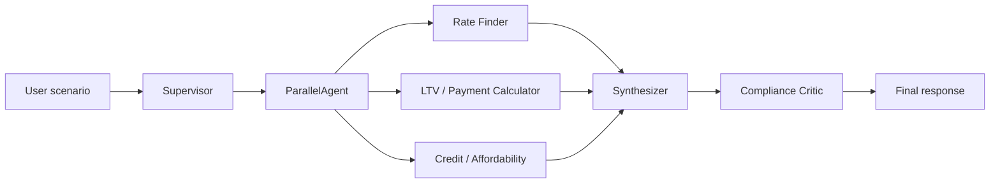

# HW3 — Multi-Agent Conventional Mortgage Explainer & Scenario Calculator

Educational mortgage scenario calculator built for UCSC AI Agent Applications. It implements the **Supervisor + Specialist Workers + Compliance Critic** pattern from the project proposal, with Zillow-style monthly payment breakdown output.

## Architecture



### Agents

| Agent | Role | Tools |
|-------|------|-------|
| Rate Finder | Benchmark rates & loan structure | `get_mortgage_rates` (FRED) |
| LTV / Payment Calculator | P&I, LTV, PMI, cash to close | `calculate_*`, `estimate_pmi` |
| Credit / Affordability | Credit tier & DTI | `analyze_credit_tier`, `score_income_affordability` |
| Compliance Critic | Math verification & advice filter | `verify_calculations` |

## Quick start (deterministic orchestrator)

From the repo root, using the course `uv` environment:

```bash
cd src && uv run python ../hw3/run_scenario.py \
  --purchase-price 1280000 \
  --interest-rate 6 \
  --property-tax 1300 \
  --home-insurance 150 \
  --hoa 25 \
  --utilities 300 \
  --annual-income 190000 \
  --credit-score 770
```

Defaults match the scenario above if you omit flags.

## Google ADK interactive mode (Doubleword)

The ADK agent graph uses **Doubleword** via LiteLLM (same pattern as `currency_agent`). Set these in `src/.env`:

```bash
DOUBLEWORD_API_KEY="your-key"
DOUBLEWORD_MODEL="openai/Qwen/Qwen3.6-35B-A3B-FP8"
DOUBLEWORD_API_URL="https://api.doubleword.ai/v1"
```

### CLI chat

```bash
cd src
uv run adk run ../hw3/adk_agents/mortgage_supervisor
```

### Web UI (recommended)

```bash
cd src
uv run adk web ../hw3/adk_agents --port 8000
```

Open **http://127.0.0.1:8000**. The **Agents** dropdown lists each specialist separately:

| Agent | Role |
|-------|------|
| `mortgage_supervisor` | Full pipeline (parallel workers → synthesizer → critic) |
| `rate_finder` | FRED benchmarks & loan structure |
| `payment_calculator` | LTV, P&I, PMI, cash to close |
| `affordability_analyzer` | Credit tier & DTI |
| `compliance_critic` | Math verification & advice filter |

Select **`mortgage_supervisor`** for the full Zillow-style scenario. Use individual agents to test one specialist at a time.

Example prompt:

> Calculate monthly payment for a $1,280,000 home, 20% down, 6% rate, 30-year fixed. Property tax $1,300/mo, insurance $150, HOA $25, utilities $300. Income $190,000, credit score 770.

## Optional: live FRED rates

Set `FRED_API_KEY` in `src/.env` and pass `--use-fred` to blend in the national 30-year benchmark (series `MORTGAGE30US`).

## Project layout

```
hw3/
  run_scenario.py          # CLI entry point
  mortgage_agents/
    tools.py               # Shared calculation tools
    orchestrator.py        # Supervisor + parallel workers + critic loop
    display.py             # Zillow-style terminal UI
    agents/
      agent.py             # Google ADK root_agent
```

## Disclaimer

Educational estimates only — not financial advice, not a loan offer, and not an underwriting decision.
