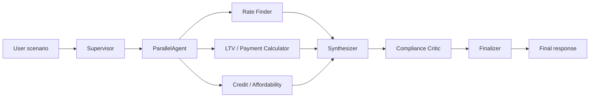

# HW3 — Multi-Agent Conventional Mortgage Explainer & Scenario Calculator

Educational mortgage scenario calculator for UCSC AI Agent Applications. Implements the **Supervisor + Specialist Workers + Compliance Critic** pattern from the project proposal, with Zillow-style monthly payment breakdown output.

**Reference scenario:** Berryessa (San Jose) home, **$1.28M** purchase, **6%** 30-year fixed, **20% down**, **$190k** household income, **770** credit score.

| Monthly cost | Amount |
|--------------|--------|
| Property tax | $1,300 |
| Home insurance | $150 |
| HOA | $25 |
| Utilities | $300 |

---

## Prerequisites

1. Python environment via `uv` (from the course `src/` folder).
2. API keys in **`src/.env`** (copy from `src/env.example`):

```bash
DOUBLEWORD_API_KEY="your-key"
DOUBLEWORD_MODEL="openai/Qwen/Qwen3.6-35B-A3B-FP8"
DOUBLEWORD_API_URL="https://api.doubleword.ai/v1"
```

Optional for live benchmark rates:

```bash
FRED_API_KEY="your-fred-key"
```

---

## How to Run

### Option 1 — Deterministic CLI (fastest, no LLM)

Runs Python orchestration + Zillow-style terminal output. Best for verifying math instantly.

```bash
cd src
uv run python ../hw3/run_scenario.py
```

With explicit flags (Berryessa scenario):

```bash
cd src
uv run python ../hw3/run_scenario.py \
  --purchase-price 1280000 \
  --interest-rate 6 \
  --property-tax 1300 \
  --home-insurance 150 \
  --hoa 25 \
  --utilities 300 \
  --annual-income 190000 \
  --credit-score 770
```

Other useful flags:

```bash
  --down-payment 256000    # override 20% default
  --down-percent 20        # default
  --monthly-debts 0        # car/student loans
  --use-fred               # blend in FRED MORTGAGE30US benchmark
  --json                   # full JSON output
```

---

### Option 2 — ADK CLI chat (LLM + multi-agent)

Interactive terminal chat powered by Doubleword via LiteLLM.

```bash
cd src
uv run adk run ../hw3/adk_agents/mortgage_supervisor
```

Type your prompt at `[user]:`. Type `exit` to quit.

> **Note:** Full supervisor pipeline runs 3 parallel specialists → synthesizer → critic → finalizer. Expect **30–60+ seconds** per request.

---

### Option 3 — ADK Web UI (recommended for demos)

Browser UI with agent dropdown, chat, and **Trace** view for each step.

```bash
cd src
uv run adk web ../hw3/adk_agents --port 8000
```

1. Open **http://127.0.0.1:8000**
2. Select an agent from the **Agents** dropdown (see table below)
3. Paste a sample prompt and send
4. Open the **Trace** tab to watch specialist progress (pipeline can take 30–60+ seconds)
5. Press `Ctrl+C` in the terminal to stop the server

| Agent | When to use |
|-------|-------------|
| `mortgage_supervisor` | Full pipeline — use for complete scenario |
| `rate_finder` | Benchmark rates & loan structure only |
| `payment_calculator` | LTV, P&I, PMI, cash to close only |
| `affordability_analyzer` | Credit tier & DTI only |
| `compliance_critic` | Review a draft for math errors & advice language |

---

## Sample Prompts (Berryessa $1.28M)

Copy-paste these into ADK CLI or Web UI. Adjust the selected agent as noted.

### `mortgage_supervisor` — full pipeline

```
I'm looking at a home in Berryessa, San Jose for $1,280,000.
20% down, 30-year fixed at 6%.
Monthly costs: property tax $1,300, home insurance $150, HOA $25, utilities $300.
Household income $190,000/year, credit score 770, no other monthly debts.
Calculate total monthly payment, LTV, PMI, cash to close, and DTI.
Explain tradeoffs — educational only, no loan recommendation.
```

### `mortgage_supervisor` — compare down payments

```
Compare 20% down vs 10% down on a $1,280,000 Berryessa home at 6% (30-year fixed).
Same costs: tax $1,300, insurance $150, HOA $25, utilities $300.
Income $190,000, credit 770. Show monthly payment, PMI, cash to close, and DTI side by side.
Educational only — no recommendation.
```

---

### `rate_finder`

```
For a conventional 30-year fixed loan on a $1,280,000 Berryessa (San Jose) purchase,
explain how today's national 30-year benchmark rate (FRED MORTGAGE30US) compares to
a 6% quoted rate. Also explain 30-year fixed vs 15-year fixed vs 5/1 ARM tradeoffs
for this price range. No recommendation — just facts.
```

---

### `payment_calculator`

```
Purchase price: $1,280,000
Down payment: 20% ($256,000)
Interest rate: 6%, 30-year fixed
Property tax: $1,300/mo
Home insurance: $150/mo
HOA: $25/mo
Utilities: $300/mo

Calculate loan amount, LTV, monthly P&I, PMI (if any), total monthly housing cost,
and estimated cash to close (include ~3% closing costs).
```

---

### `affordability_analyzer`

```
Gross annual household income: $190,000
Credit score: 770
Other monthly debts: $0
Proposed total monthly housing payment: $7,914
(includes P&I ~$6,139, tax $1,300, insurance $150, HOA $25, utilities $300)

What credit tier does 770 map to? What are front-end and back-end DTI ratios?
How do those compare to typical conventional guidelines? Illustrative only.
```

---

### `compliance_critic`

```
Review this draft mortgage summary for math errors and advice-giving language:

"On a $1,280,000 Berryessa home with $256,000 down (20%), the loan is $1,024,000
at 6% for 30 years. Monthly P&I is $6,139. With tax ($1,300), insurance ($150),
HOA ($25), and utilities ($300), total monthly cost is $7,914.
At $190,000 income, front-end DTI is 50%. You should take this loan — you can afford it."

Verify P&I with loan_amount=1024000, rate=6%, term=30, reported_monthly_pi=6139.
Flag any issues and rewrite without advice language.
```

---

## Architecture



### Agents & tools

| Agent | Role | Tools |
|-------|------|-------|
| Rate Finder | Benchmark rates & loan structure | `get_mortgage_rates` (FRED) |
| LTV / Payment Calculator | P&I, LTV, PMI, cash to close | `calculate_*`, `estimate_pmi` |
| Credit / Affordability | Credit tier & DTI | `analyze_credit_tier`, `score_income_affordability` |
| Compliance Critic | Math verification & advice filter | `verify_calculations` |

### Expected results (Berryessa scenario, 20% down)

| Metric | Value |
|--------|-------|
| Down payment | $256,000 |
| Loan amount | $1,024,000 |
| Principal & interest | ~$6,139/mo |
| Total monthly (incl. tax, ins, HOA, utils) | ~$7,914/mo |
| LTV | 80% (no PMI) |
| Front-end DTI | ~50% |
| Cash to close (~3% closing) | ~$294,400 |

---

## Project layout

```
hw3/
  README.md
  run_scenario.py              # Deterministic CLI
  adk_agents/                  # ADK web/run entrypoints (one folder per agent)
    mortgage_supervisor/
    rate_finder/
    payment_calculator/
    affordability_analyzer/
    compliance_critic/
  mortgage_agents/
    tools.py                   # Shared calculation tools
    builders.py                # ADK agent definitions
    orchestrator.py            # Python supervisor + critic loop
    display.py                 # Zillow-style terminal UI
    model_config.py            # Doubleword / LiteLLM config
    agents/agent.py            # Legacy ADK entrypoint
```

---

## Troubleshooting

| Issue | Fix |
|-------|-----|
| Web UI freezes on submit | Use `../hw3/adk_agents` (not `mortgage_agents/agents`). Check terminal for 500 errors. |
| `DOUBLEWORD_API_KEY is missing` | Add key to `src/.env` |
| Only one agent in dropdown | Point `adk web` at `../hw3/adk_agents`, not a single agent folder |
| Slow responses | Normal for `mortgage_supervisor` (5 LLM stages). Use **Trace** tab or `run_scenario.py` for instant math |
| FRED rates unavailable | Set `FRED_API_KEY` or use `--interest-rate` / user-supplied rate |

---

## Disclaimer

Educational estimates only — not financial advice, not a loan offer, and not an underwriting decision.
